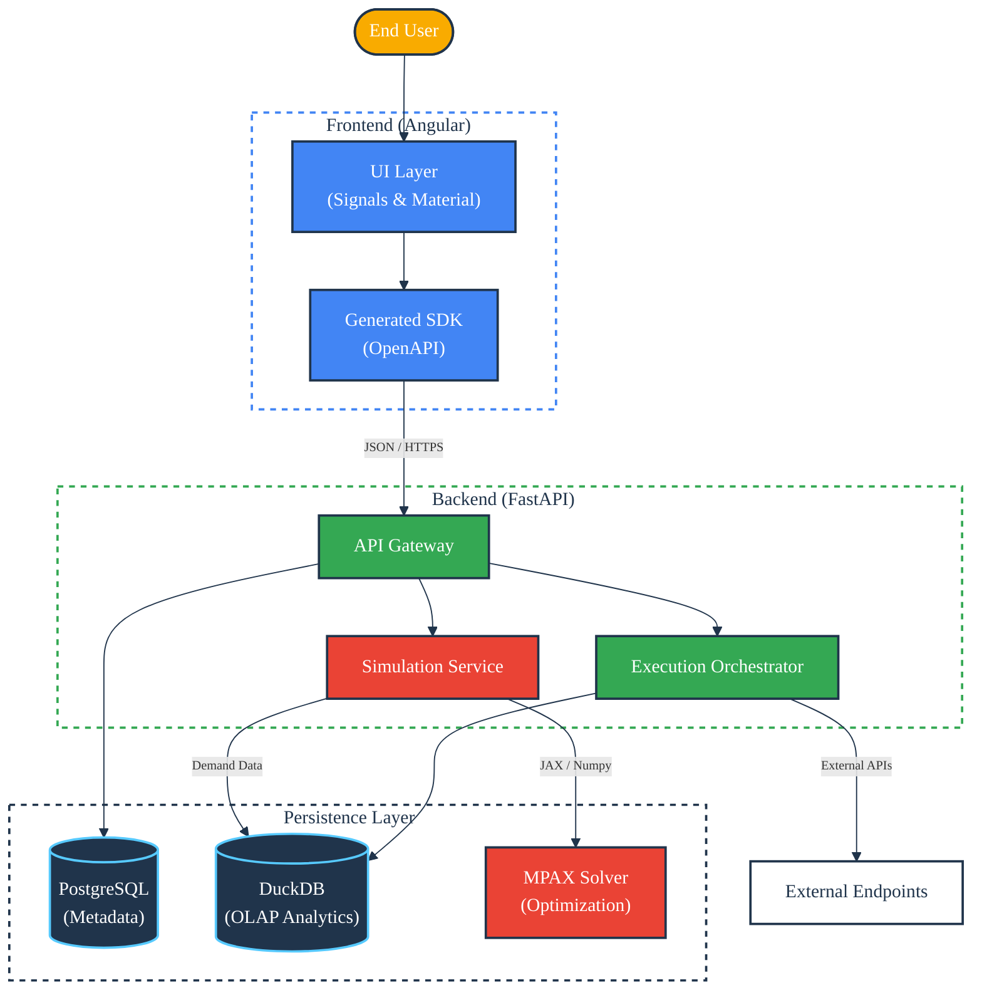
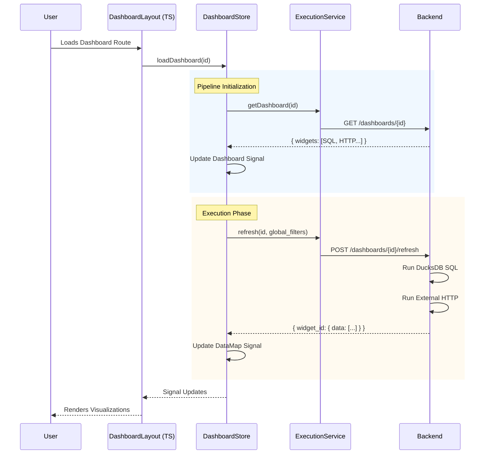
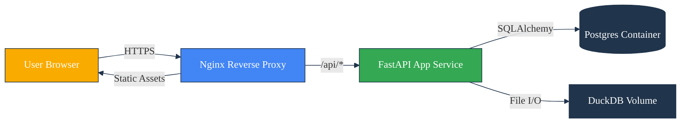

# Architecture

> **Purpose:** This document details the technical design, system overview, component diagrams, and interactions that define the Pulse Query platform. It serves as the primary technical reference for understanding the split-stack architecture and data flow.

**Pulse Query** is an enterprise-grade hospital analytics platform designed to bridge the gap between operational data (EHR logs) and strategic decision-making (Capacity Planning). It employs a **Split-Stack Architecture** optimized for strict typing, rapid analytical queries, and complex optimization modeling.

---

## 1. System Overview

The platform uses a decoupled interaction model where the Frontend communicates exclusively via a REST API. The Backend acts as an orchestration layer, routing requests to either a transactional metadata store (PostgreSQL), an analytical engine (DuckDB), or a mathematical solver (MPAX).

### High-Level Components

---

## 2. Backend Architecture (`/backend`)

The backend is built on **FastAPI** using Python 3.12+. It is designed around the **Service Repository Pattern** but specifically adapted for Analytics use cases.

### Core Modules

1.  **Dual-Database Strategy:**
    - **PostgreSQL (`app.database.postgres`):** Stores "State". Users, Dashboard configurations, Widget positioning, and Template registry. Accessed via `SQLAlchemy (Async)`.
    - **DuckDB (`app.database.duckdb`):** Stores "Data". Ingested CSVs provided by the hospital. Accessed via native bindings purely for read-only aggregation queries.

2.  **Execution Engine:**
    The `Orchestrator` determines how to fulfill a widget's data request:
    - **SQL Widgets:** Validated via `sqlglot` -> Executed against DuckDB.
    - **HTTP Widgets:** Executed locally via `httpx` (proxy behavior).

3.  **Optimization Bridge (MPAX):**
    The system includes a bridge to **MPAX**, a JAX-based linear programming solver. This allows the backend to perform "What-If" capacity planning by pulling live demand from DuckDB and solving allocation constraints in memory.

### Data Ingestion Pipeline

On startup, `app.services.data_ingestion` scans the `data/` directory. It sanitizes filenames and loads CSVs directly into the DuckDB persistent file (`hospital_analytics.duckdb`), creating indices on commonly filtered columns (e.g., `Clinical_Service`).

---

## 3. Frontend Architecture (`/pulse-query-ng-web`)

The frontend is a modern **Angular 17+** application utilizing **Standalone Components** and **Signals** for state management. It is designed with a **Contract-First** methodology.

### Architecture Highlights

1.  **Strictly Typed Client:**
    The API layer (`src/app/api-client`) is **not** written manually. It is generated via `generate_client.sh` from the Backend's OpenAPI JSON. This ensures that any change in Python schemas immediately flags compilation errors in TypeScript.

2.  **Signal-Based State Management:**
    Instead of heavy libraries like NgRx, the app uses localized `Injectable` stores (`DashboardStore`, `SimulationStore`) leveraging Angular `signal`, `computed`, and `effect`.
    - **Optimistic UI:** Actions like "Move Widget" or "Delete Dashboard" update the UI signal immediately, reverting only if the API call fails.

3.  **Visualization Layer:**
    Widgets are rendered via "Dumb Components" (`viz-table`, `viz-chart`, `viz-heatmap`) that accept raw data and configuration inputs. The logic for transforming API responses into visual structures resides in these components involving computed signals.

### Dashboard Layout Flow

---

## 4. Key Design Patterns

### A. The "Ghost Grid" (Skeleton Loading)

To prevent layout shift (CLS), the dashboard renders a skeleton structure (`app-skeleton-loader`) matching the grid layout while data is fetching. This is managed by the `isLoading` signal in the `DashboardStore`.

### B. Analytical Security via AST

The SQL Runner (`backend/app/services/runners/sql.py`) does not rely on Regex for security. It parses user queries into an **Abstract Syntax Tree (AST)** using `sqlglot`. It recursively walks the tree to ensure **only** `SELECT` and `CTE` statements are present, rejecting `DROP`, `DELETE`, or hidden modification commands before they touch the database.

### C. The "Marketplace" Seeder

Standard analytical questions are stored as Templates.

1.  **JSON Definition:** `backend/data/initial_templates.json`.
2.  **Seeding:** On startup, `template_seeder.py` upserts these definitions into Postgres.
3.  **Usage:** Users select templates in the frontend wizard; the backend instantiates a Widget copy with specific parameters injected into the SQL via Handlebars syntax (e.g., `{{unit_name}}`).

### D. Simulation Loop

The Simulation feature bypasses the standard widget flow:

1.  Frontend sends parameters (e.g., "Reduce ICU Capacity by 20%").
2.  Backend runs a **Snapshot Query** against DuckDB to get current patient load.
3.  Backend feeds Snapshot + Params into **MPAX/JAX**.
4.  Solver optimizes bed allocation.
5.  Results return to frontend as distinct "Scenario Results".

---

## 5. Deployment Topology

In a production environment, the services communicate over a private Docker network.

