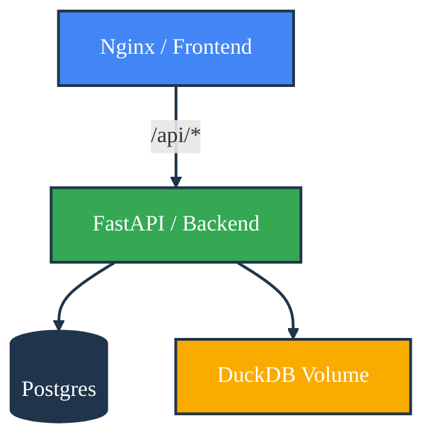

Maintenance & Contribution Guide
================================

This document outlines the workflows for extending, testing, and deploying the **pulse-query** platform.

---

## 🛠️ Development Workflow

The project relies heavily on **Contract-First Development**. Changes to the Backend API must be synchronized with the Frontend via the generator script.

### Adding a New Feature

1.  **Backend:**
    *   Define Pydantic models in `backend/app/schemas`.
    *   Create API routes in `backend/app/api/routers`.
    *   Register router in `backend/app/main.py`.
2.  **Sync:**
    *   Run `./generate_client.sh` from the root. This updates `frontend/src/app/api-client`.
3.  **Frontend:**
    *   Use the new Service in your Angular components (e.g., `inject(NewService)`).

---

## 🧪 Testing Strategy

We employ a pyramid testing strategy covering Unit, Integration, and End-to-End tests.

### 1. Backend Tests (Pytest)
Located in `backend/tests`. Focuses on API logic and Runner stability.

*   **Run all tests:**
    ```bash
    cd backend
    uv run pytest
    ```
*   **Specific Execution Logic:**
    *   `test_execution_api.py`: Mocks the DuckDB execution to ensure widgets are parsed correctly.
    *   `test_runner_sql.py`: Validates SQL execution against an in-memory database.

### 2. Frontend Tests (Jasmine/Karma)
Located in `frontend/src/**/*.spec.ts`. Focuses on Component rendering and Store state changes.

*   **Run tests:**
    ```bash
    cd frontend
    npm test
    ```
*   **Key Specs:**
    *   `dashboard.store.spec.ts`: Critical for verifying data loading states.
    *   `sql-builder.component.spec.ts`: Tests the interaction between Code view and AI Chat.

### 3. E2E Tests (Playwright)
Located in `e2e/`. Simulates real user flows against a running stack.

*   **Run E2E:**
    ```bash
    # Ensure Backend (port 8000) and Frontend (port 4200) are running
    npx playwright test
    ```

---

## 📦 Extending Logic

### Adding a New Visualization
To add a new visualization type (e.g., `PieChart`):

1.  **Frontend:** Create `viz-pie.component.ts` in `frontend/src/app/shared/visualizations`.
2.  **Frontend:** Update `widget.component.ts`:
    ```typescript
    // Import component
    import { VizPieComponent } from '...';

    // In template [ngSwitch]
    <viz-pie *ngSwitchCase="'pie'" [data]="typedData()"></viz-pie>
    ```
3.  **Backend:** No changes needed unless specific data formatting is required by the SQL Runner.

### Extending the Database Schema
1.  **Edit Models:** Update `backend/app/models/`.
2.  **Generate Migration:**
    ```bash
    cd backend
    uv run alembic revision --autogenerate -m "Add description"
    ```
3.  **Apply:**
    ```bash
    uv run alembic upgrade head
    ```

### Managing DuckDB Data
The OLAP file is located at `backend/hospital_analytics.duckdb`.
*   **Reset Data:** Delete the file and run `uv run python scripts/ingest.py`.
*   **Schema Changes:** If the CSV structure changes, update validity checks in `ingest.py`.

---

## 🚢 Deployment

### Production Build
The application is designed to be containerized.

1.  **Frontend Build:**
    ```bash
    cd frontend
    npm run build --prod
    # Output located in dist/pulse-query
    ```
2.  **Backend Build:**
    Ensure `production` settings in `backend/app/core/config.py` are used via Environment Variables.

### Docker Compose (Sample Production)
To deploy, map the Frontend build to an Nginx container and the Backend to a Python container.


