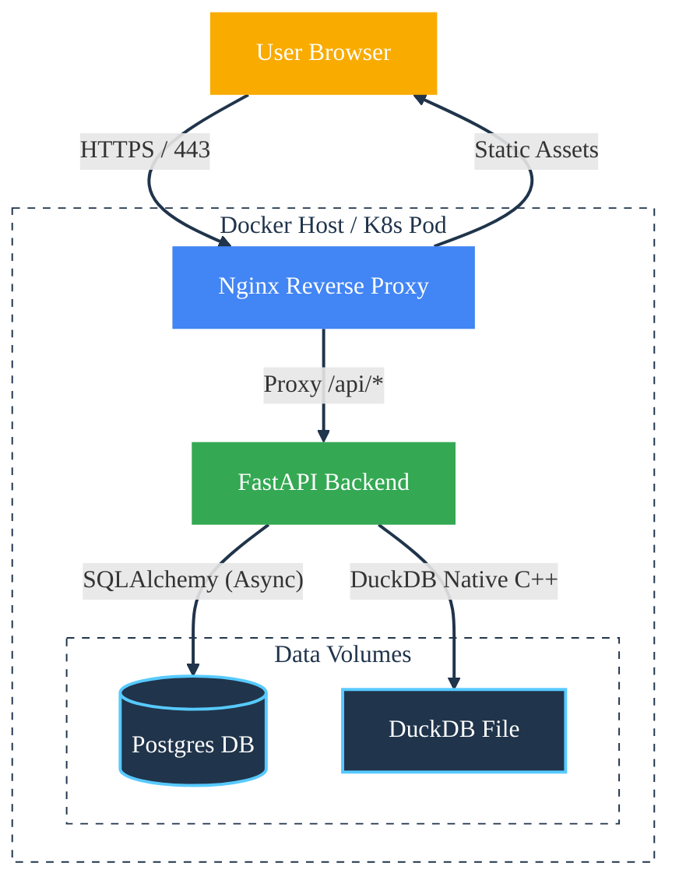

Maintenance
===========

This document outlines the workflows for extending, testing, and deploying the **Pulse Query** platform. It provides specific instructions for maintaining the split-stack architecture (Angular + FastAPI) and the data engineering pipelines.

---

## 🛠️ Development Workflow

The project strictly adheres to **Contract-First Development**. The Frontend API client is **generated**, not written manually.

### 1. Adding a New Feature
1.  **Backend Implementation:**
    *   Define Pydantic schema in `backend/src/app/schemas`.
    *   Implement logic in `backend/src/app/api/routers`.
    *   Register the router in `backend/src/app/main.py`.
2.  **Synchronize Contract:**
    *   From the root directory, run the generation script: (Requires Backend to be running or importable)
        ```bash
        ./generate_client.sh
        ```
    *   *Action:* This updates `pulse-query-ng-web/src/app/api-client` with new TypeScript interfaces and Services.
3.  **Frontend Implementation:**
    *   Inject the generated Service (e.g., `ExecutionService`) into your Angular components or Stores.

---

## 🧪 Testing Strategy

We employ a pyramid testing strategy covering Unit, Integration, and End-to-End tests.

### 1. Backend Tests (Pytest)
Located in `backend/tests`. Focuses on API logic, SQL Security AST validation, and MPAX solver integration.

*   **Command:**
    ```bash
    cd backend
    uv run pytest
    ```
*   **Critical Suites:**
    *   `test_runner_sql_security.py`: Ensures `sqlglot` effectively blocks destructive queries (DROP, DELETE).
    *   `test_mpax_bridge.py`: Verifies the JAX optimization solver logic.
    *   `test_execution_api_caching.py`: Validates that the custom LRU cache prevents redundant OLAP queries.

### 2. Frontend Tests (Vitest)
Located in `pulse-query-ng-web/src/**/*.spec.ts`. Focuses on Signal-based state management and Component rendering.

*   **Command:**
    ```bash
    cd pulse-query-ng-web
    npm test
    ```
*   **Critical Specs:**
    *   `dashboard.store.spec.ts`:  Verifies the RxJS `switchMap` pipelines handling race conditions during data refreshing.
    *   `global-error.handler.spec.ts`: Ensures the global error bus correctly captures and displays SnackBar notifications.

### 3. E2E Tests (Playwright)
Located in `e2e/`. Simulates critical user journeys against a running full-stack environment.

*   **Command:**
    ```bash
    # Ensure Backend (port 8000) and Frontend (port 4200) are running
    npx playwright test
    ```

---

## 📦 Data & Schema Management

### Analytical Data (DuckDB)
The OLAP store is a file-based database (`hospital_analytics.duckdb`).
*   **Ingestion:** The system automatically ingests CSV files from `backend/data/` on startup.
*   **Manual Reset:**
    To force a complete data rebuild:
    ```bash
    cd backend
    rm hospital_analytics.duckdb
    uv run python scripts/ingest.py
    ```
*   **Schema Safety:** The `DataIngestionService` sanitizes filenames to create SQL-safe table names. If adding new CSVs, ensure columns do not contain special characters to simplify SQL generation.

### Metadata Schema (PostgreSQL)
Application state (Users, Dashboards) is managed via Alembic.
1.  **Modify Models:** Edit `backend/src/app/models/`.
2.  **Generate Migration:**
    ```bash
    cd backend
    uv run alembic revision --autogenerate -m "Describe change"
    ```
3.  **Apply Migration:**
    ```bash
    uv run alembic upgrade head
    ```

### Template Registry
Standard analytical templates are defined in `backend/data/initial_templates.json`.
*   **Updates:** Edit the JSON file directly. The `TemplateSeeder` service runs on startup and performs an **Idempotent Upsert** based on the Template Title. Changes to SQL or Descriptions in JSON will propagate to the DB on the next restart.

---

## 🎨 Frontend Architecture Maintenance

### Adding a New Visualization
The frontend uses a "Dumb Component" strategy for visualizations. To add a new type (e.g., `RadarChart`):

1.  **Create Component:** `pulse-query-ng-web/src/app/shared/visualizations/viz-radar/viz-radar.component.ts`.
2.  **Register in Switch:** Update `pulse-query-ng-web/src/app/widget/widget.component.ts`:
    ```typescript
    // Import
    import { VizRadarComponent } from '../shared/visualizations/viz-radar/viz-radar.component';

    // In @Component.imports
    imports: [ ..., VizRadarComponent ]

    // In Template @switch
    @case ('radar') { <viz-radar [dataSet]="typedDataAsTable()"></viz-radar> }
    ```
3.  **Update Wizard:** Add the option to `widget-creation.dialog.ts` so users can select it.

### Zoneless Architecture
The application uses **Experimental Zoneless Change Detection**.
*   **Do not** rely on `NgZone.run()`.
*   **Do** use `signal`, `computed`, and `AsyncPipe` (or `@if` with observables).
*   If integrating 3rd party libraries that detach from Angular, manually trigger Change Detection via `ChangeDetectorRef` is usually not needed if Signals are used correctly.

---

## 🚢 Deployment Topology

The system is designed for containerized deployment.



### Production Checklist
1.  **Environment Variables:** Ensure `SECRET_KEY` and `POSTGRES_PASSWORD` are set in the production environment (e.g., `.env` or K8s Secrets), overriding defaults in `config.py`.
2.  **Build:**
    *   Frontend: `npm run build` (Output: `dist/pulse-query-ng-web/browser`).
    *   Backend: Copy `src/` and `alembic/`.
3.  **Reverse Proxy:** Configure Nginx to serve the Static Frontend files for root requests and proxy `/api` requests to the Uvicorn worker running the FastAPI app.
