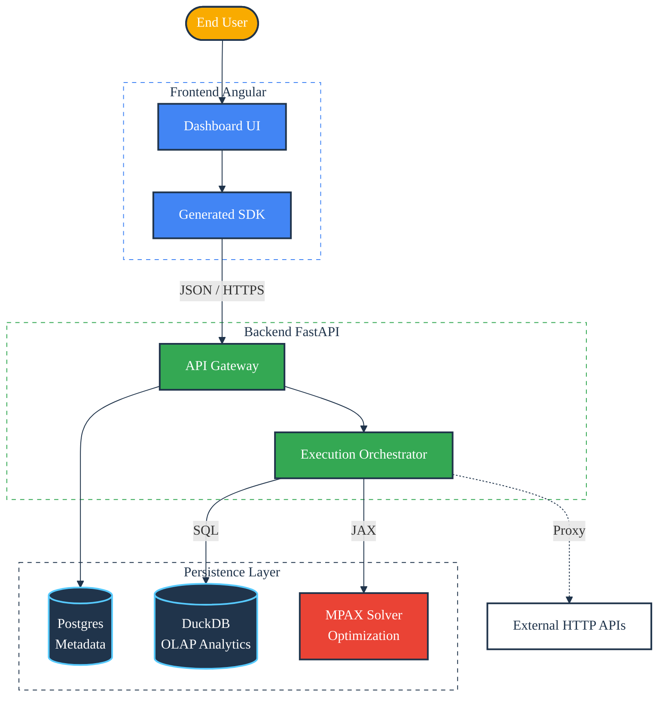

Pulse Query: Hospital Analytics Platform
========================================
[](https://opensource.org/licenses/Apache-2.0)
[](https://github.com/SamuelMarks/hospital-dashboard-platform/actions/workflows/test-python-and-angular.yml)
 

**Pulse Query** is an enterprise-grade hospital analytics platform designed to bridge the gap between operational data (EHR logs) and strategic decision-making (Capacity Planning). 

It features a **Split-Stack Architecture** that combines the strict typing of a modern Angular frontend with the raw analytical power of DuckDB and the mathematical optimization capabilities of JAX/MPAX on the backend.

---

## 🏗️ Architecture

The system uses a decoupled interaction model where the Frontend communicates exclusively via a REST API. The Backend acts as an orchestration layer, routing requests to either a transactional metadata store (PostgreSQL), an analytical engine (DuckDB), or a mathematical solver (MPAX).



### Core Components

1.  **Dual-Database Strategy**:
    *   **PostgreSQL**: Manages application state (Users, Dashboards, Widgets, Templates).
    *   **DuckDB**: High-performance OLAP engine for querying hospital CSV data directly.
2.  **MPAX / JAX Solver**: Performs linear programming optimization for "What-If" capability planning scenarios (e.g., maximizing bed utilization under constraints).
3.  **Strictly Typed Frontend**: An Angular application that generates its entire API client layer from the Backend's OpenAPI specification, ensuring contract reliability.

---

## ✨ Key Features

*   **📊 Dynamic Dashboards**: Build responsive dashboards with grids of widgets powered by DuckDB SQL or external HTTP APIs.
*   **🤖 AI Assistant**: Natural‑language to SQL generation with multi‑model candidate outputs and human selection.
*   **🏟️ LLM Arena Analytics**: Inspect which user queries generated which SQL, by which LLM, and how each candidate was scored/selected.
*   **🧪 Experiment Logs**: `/api/v1/ai` experiment runs are captured alongside chat arena results for unified analysis and comparison.
*   **🔎 SQL Preview for Candidates**: Execute candidate SQL against the preview endpoint to compare results before selecting.
*   **🧰 Query Cart**: Stage ad‑hoc SQL and drag it into dashboards for rapid iteration and collaboration.
*   **🧩 Template Marketplace**: Pre‑packaged analytics templates ("Utilization Spikes", "Seasonal Growth") with parameterized inputs.
*   **📐 Widget Builder**: Configure SQL widgets, HTTP‑backed widgets, and text/markdown summaries in one flow.
*   **🔮 Simulation & Optimization**: Run complex scenarios to optimize patient‑to‑bed allocation using mathematical solvers.
*   **🛡️ Analytical Security**: AST‑based SQL validation ensures only safe `SELECT` and `CTE` queries are executed.
*   **🔗 Contract‑First Frontend**: OpenAPI‑generated Angular client ensures frontend/backend schema consistency.

---

## 🚀 Getting Started

### Prerequisites

*   **Docker** (for PostgreSQL database)
*   **Python 3.12+**
*   **Node.js 18+** & **NPM**
*   **uv** (Python dependency manager): `curl -LsSf https://astral.sh/uv/install.sh | sh`

### 1. Backend Setup

The backend handles data ingestion and API serving.

```bash
cd backend

# 1. Start Infrastructure (Postgres)
docker-compose up -d
# or
docker run -d --rm --name run-postgres \
  -e POSTGRES_USER='postgres' \
  -e POSTGRES_PASSWORD='postgres' \
  -e POSTGRES_DB='pulse_query_db' \
  -p 5433:5432 postgres:alpine
# 2. Install Dependencies
uv sync

# 3. Apply Database Migrations (Postgres Schema)
uv run alembic upgrade head

# 4. Ingest Sample Data (DuckDB)
# Loads CSVs from /data into the local DuckDB file
uv run python3 scripts/ingest.py

# 5. Start the Server
uv run uvicorn --app-dir src app.main:app --reload
```
*API will differ at `http://localhost:8000` (Docs at `/docs`)*

### 2. Frontend Setup

The frontend is an Angular application. It requires the backend to be running to generate the client SDK.

```bash
# (In a separate terminal)

# 1. Generate API Client
# This extracts openapi.json from the running backend and builds TypeScript files
./generate_client.sh

# 2. Install Node Dependencies
cd pulse-query-ng-web
npm install

# 3. Run Development Server
npm start
```
*UI will differ at `http://localhost:4200`*

---

## 🛠️ Maintenance & Development

This project uses **Contract-First Development**.

*   **Backend Changes**: If you modify Pydantic schemas or API routes in FastAPI, you **must** run `./generate_client.sh` to update the Frontend SDK.
*   **Data Updates**: To reset the analytical data, delete `backend/hospital_analytics.duckdb` and re-run `uv run python scripts/ingest.py`.
*   **Testing**:
    *   Backend: `uv run pytest`
    *   Frontend: `npm test`
    *   E2E: `npx playwright test` (Requires running backend/frontend)

See [MAINTENANCE.md](MAINTENANCE.md) for detailed contribution guides.

---

## 📄 License

This project is licensed under the Apache 2.0 License - see the [LICENSE](LICENSE) file for details.
