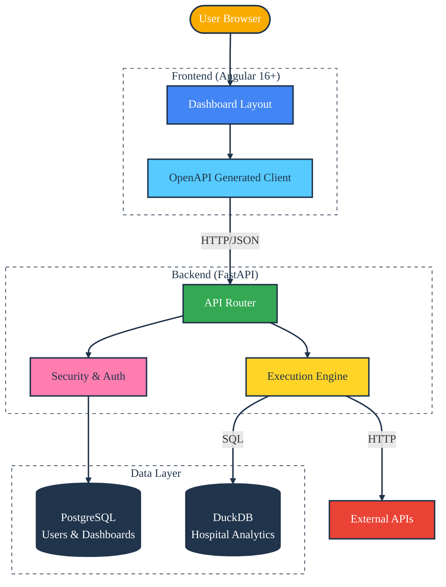

Pulse Query: Hospital Analytics Platform
========================================
[](https://opensource.org/licenses/Apache-2.0)
[](https://github.com/SamuelMarks/hospital-dashboard-platform/actions/workflows/test-python-and-angular.yml)

**Pulse Query** is an enterprise-grade analytics platform designed for healthcare data. It enables users to create dynamic dashboards, execute raw SQL queries against an OLAP engine (DuckDB), and leverage AI-assisted query building, all wrapped in a strictly typed, modern architecture.

## 🏗️ Architecture

The application uses a split-stack architecture. The Backend serves as a monolithic API gateway handling authentication and orchestration, while data processing is split between PostgreSQL (Metadata) and DuckDB (OLAP).



---

## 🚀 Getting Started

### Prerequisites
*   **Docker & Docker Compose** or manually run your own PostgreSQL server
*   **Python 3.12+** (Backend)
*   **Node.js 18+ & NPM** (Frontend)
*   **uv** (Python dependency management) - Install via `pip install uv` or `curl -LsSf https://astral.sh/uv/install.sh | sh`

### 1. Backend Setup

1.  **Start Infrastructure:**
    Launch the PostgreSQL metadata database.
    ```bash
    cd backend
    docker-compose up -d
    # or
    docker run --name postgres \
      -e POSTGRES_PASSWORD=postgres \
      -e POSTGRES_DB=app_db \
      -p 5433:5432 \
      postgres:18-alpine
    ```

2.  **Install Dependencies:**
    ```bash
    uv sync
    ```

3.  **Apply Migrations:**
    Initialize the PostgreSQL schema for users and dashboards.
    ```bash
    # Ensure .env is set or use defaults in core/config.py
    uv run alembic upgrade head
    ```

4.  **Ingest Sample Data:**
    Generate and load the hospital analytics dataset into DuckDB.
    ```bash
    uv run python scripts/ingest.py
    ```

5.  **Run Server:**
    ```bash
    uv run uvicorn --app-dir src app.main:app --reload
    ```
    *API is now live at `http://localhost:8000`*

### 2. Frontend Setup

1.  **Install Dependencies:**
    ```bash
    cd frontend
    npm install
    ```

2.  **Generate API Client:**
    The frontend relies on specific types generated from the backend OpenAPI spec.
    ```bash
    # (From project root)
    ./generate_client.sh
    ```

3.  **Run Application:**
    ```bash
    cd frontend
    npm start
    ```
    *UI is now live at `http://localhost:4200`*

---

## 🔑 Key Features

1.  **Mixed-Mode Execution:** The backend `ExecutionService` can run multiple widget types simultaneously:
    *   **SQL Widgets:** Executed locally via DuckDB.
    *   **HTTP Widgets:** Fetched asynchronously from external APIs.
2.  **AI Assistant:** Integrated Chat interface in the SQL Builder to convert natural language (e.g., "Show me patients per dept") into SQL.
3.  **Strict Typing:** The frontend uses an auto-generated SDK, ensuring that API changes in the backend immediately flag errors in the frontend build process.
